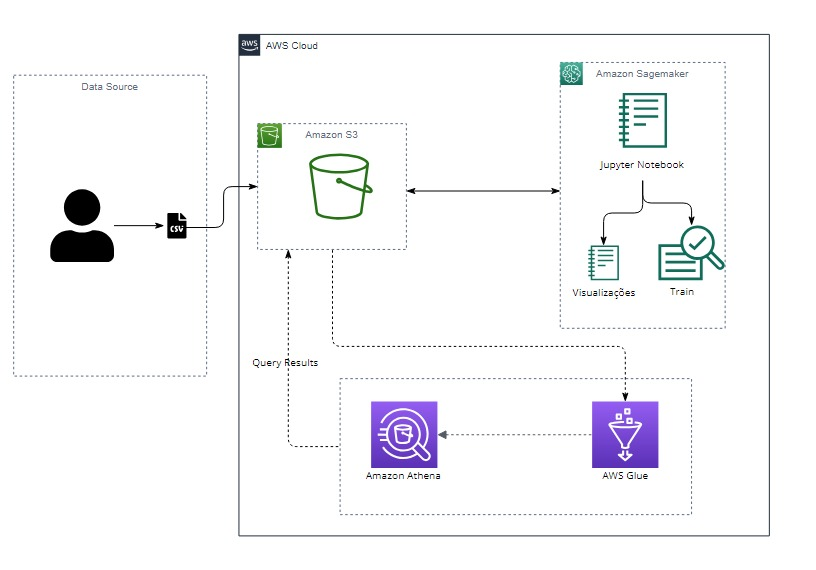

# Predição de Métricas de Mídia Digital

## Especialização em Ciência de Dados
#### Projeto Interdisciplinar - 2o. Semestre

# Contexto
Há três principais tipos de campanha no Marketing Digital, são elas:

*Awareness* - Tem por objetivo impactar um público alvo para divulgação da marca/produto.

*Consideração* - Aqui, a campanha busca um público que já conhece a marca ou concorrentes, com o objetivo de construir uma relação de confiança.

*Conversão* - Por fim, a campanha de conversão tenta levar o público a comprar e/ou fidelizar.

O CTR é uma taxa dada pela relação entre o número de cliques / número de impressões de um anúncio, e é um dos principais indicadores da qualidade de uma campanha. Uma taxa alta indica interesse do público alvo. Uma taxa baixa sugere que o anúncio pode não ser atrativo ou o público talvez não seja o ideal naquele contexto. Predizer as Impressões e Cliques nos ajudará a entender o impacto do anúncio. 

# Objetivo
Ao iniciar uma campanha a equipe responsável precisa determinar uma meta de CTR com o orçamento disponível, um modelo de machine learning pode ajudar a prever essa taxa baseado no canal, formato do anúncio, objetivo de campanha, público alvo entre outras condições.

Alguns canais têm seu próprio tipo de predição, como é o caso de meta e tiktok, no entanto o desempenho geral da campanha depende também das combinações entre eles.

O objetivo aqui é, através de dados de diferentes campanhas prever o número de cliques e as impressões de uma campanha. A divisão destes números é o CTR.

# Arquitetura e Infraestrutura de Dados
Os dados foram inicialmente armazenados em formato CSV no Amazon S3. Em seguida, empregamos um processo de Crawling para extrair metadados e criar automaticamente uma tabela no AWS Glue Data Catalog, proporcionando uma camada estruturada sobre os dados armazenados no S3.

Utilizando o Amazon Athena, uma ferramenta de consulta interativa, realizamos consultas SQL diretamente sobre esses dados tabulares, permitindo análises ágeis e eficientes. Essa abordagem facilita a extração de insights valiosos por meio da execução de queries SQL na camada de dados, sem a necessidade de carregamentos adicionais, proporcionando uma solução escalável e eficaz para análise de dados no ambiente da AWS.

Paralelamente, utilizamos o notebook do Amazon SageMaker como nossa ferramenta principal para acessar os conjuntos de dados CSV armazenados no Amazon S3. 

Neste ambiente, realizamos tanto a análise exploratória dos dados quanto a modelagem preditiva das variáveis alvo. A flexibilidade e as poderosas capacidades do SageMaker permitiram-nos efetuar tarefas analíticas e de aprendizado de máquina de maneira integrada, consolidando assim o processo de exploração e predição em um único ambiente de desenvolvimento. Isso proporcionou eficiência e coesão ao nosso fluxo de trabalho analítico na AWS.

## Diagrama da Arquitetura de Dados
O diagrama abaixo mostra a arquitetura utilizada:

**Observações:**
1. Foram utilizados dois buckets no S3. Um para o armazenamento dos dados no formato CSV e outro para armazenamento do resultado das queries do Athena.
2. A análise exploratória e o treinamento do modelo foram feitos em um notebook no SageMaker.
3. A região utilizada foi a N. Virginia.

# Queries SQL
Conforme requisito do projeto, executamos 10 queries SQL, que são apresentadas no arquivo [queries.txt](./SQL%20Queries/queries.txt)

# Metadados
Os dados disponíveis relatam a jornada do usuário nas mídias Instagram/Facebook, Twitter, Kwai, Tiktok, Pinterest e Youtube de um grupo de marcas. R$90M foram gastos para que os anúncios fossem exibidos pelo menos 30BI de vezes. 

**Features:**

**Cost** - Moeda em Reais relatando o custo de cada anúncio.

**Comments, Reactions, Saves e Shares** - Engajamentos do usuário com o anúncio.

**Start Video Views** - Total de plays no anúncio quando em formato de video.

**Video Watches at 100%** - Total de vídeos assistidos por completo. 

**Influ** - 1 quando o anúncio usou da imagem de um influencer, 0 quando não.

**Funnel** - Identificação do objetivo do anúncio.

**Format** - formato do anúncio.

**Channel** - Mídia onde o anúncio foi exibido

**Targets:**

**Impressions** - O total de vezes que o anúncio foi exibido.

**Link Clicks** - O total de vezes que o usuário clicou no link veiculado ao anúncio.

Há ainda a possibilidade de criar outras métricas úteis para análises usando as disponíveis na base como:

**CPM** - (Investimento/Impressões)*1000

**CPC** - Investimento/Cliques

**CTR** - Cliques/Impressões

# Preparação dos dados
A base tem muitos dados nulos que não podem ser modificados e nem todos os canais e anúncios têm o mesmo tipo de comportamento. Por exemplo, em Meta o usuário pode engajar com o anúncio curtindo, comentando, salvando e compartilhando, em Pinterest o usuário pode apenas salvar o pin, em Twitter por sua vez há opção de retweet, reply e like. Optamos por somar essas colunas e nomear de “Engajamento”.

Alguns anúncios estão em formato de vídeo, outros como imagens estáticas e alguns a junção dos dois. Também há alguns sem uma definição clara. Optamos por manter assim. 

Com as colunas de Investimento, Funil, Canal, Formato e Influencer  podemos predizer as Impressões e os Cliques e assim chegaremos ao CTR.

Também notamos outliers vindos de anúncios com baixo alcance ou com interações orgânicas. Com o uso do Isolation Forest identificamos as anomalias e as separamos.

Os scripts em python da preparação de dados, a análise exploratória, e treinamento do modelo podem ser vistos nesse [notebook](./Notebook/Predicao_de_Cliques_e_Impressoes.ipynb).

# Resultados
Após a codificação dos dados categóricos com o Dummies do Pandas, excluímos uma coluna de cada categoria a fim de evitar o Dummy Variable Trap.

Dado o tamanho da base de cerca de 6 mil linhas, o conjunto de treinamento e teste foi dividido em 90/10.

Para os ajustes de hiperparâmetros optamos pela Bayes Search.

A otimização bayesiana é uma técnica baseada no teorema de Bayes, que descreve a probabilidade de ocorrência de um evento relacionado ao conhecimento atual. Quando isso é aplicado à otimização de hiperparâmetros, o algoritmo cria um modelo probabilístico a partir de um conjunto de hiperparâmetros que otimiza uma métrica específica. Ele usa análise de regressão para escolher iterativamente o melhor conjunto de hiperparâmetros.
A métrica escolhida para avaliação de desempenho dos modelos foi R².

Mesmo a normalização não sendo obrigatória em casos de regressão, optamos por simular o Random Forest na base com e sem o Robust Scaler. No Gradient Boosting não foi feita normalização.
O modelo Random Forest processou dois target’s simultaneamente quando atribuímos ao y uma lista.

O Gradient Boosting, por sua vez, exige o MultiOutputRegressor do Sklearn. No entanto, quando o unimos com o Bayes Search é necessário dividir os targets na busca pelos hiperparâmetros.

Por fim, o modelo Gradient Boosting em conjunto com o Kfold resultou no R² de 0.75 para Clicks e 0.73 para Impressions, o melhor desempenho entre as simulações realizadas.

Uma visualização mais aprofundada pode ser vista nesse [notebook](./Notebook/Predicao_de_Cliques_e_Impressoes.ipynb).
